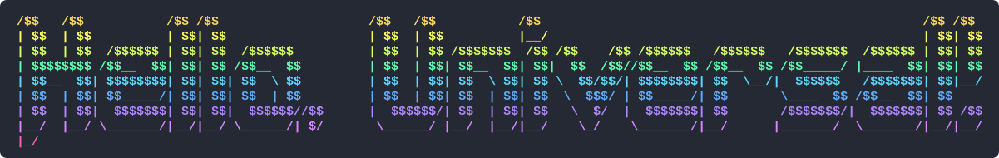

<!---->

  

<strong>Software Engineering at Universal Store</strong> - the code behind Universal Store, Perfect Stranger and Thrills.

---

<!-- All below here is placeholder AI generated text that needs to be reviewd-->
<!--
We build and run the commerce platform: the Shopify storefronts customers shop on, the AWS services that move orders, inventory and products between Shopify, NewStore, NetSuite and the warehouse, and the internal tools the business uses day to day.

## Where to start

| If you are… | Go to |
| --- | --- |
| A new engineer setting up a Mac | [`engineering-mac-bootstrap`](https://github.com/UniversalStore/engineering-mac-bootstrap) |
| Working on backend services | [`monorepo`](https://github.com/UniversalStore/monorepo) |
| Working on the storefront | [`ShopifyUSTheme`](https://github.com/UniversalStore/ShopifyUSTheme) / [`ShopifyPSTheme`](https://github.com/UniversalStore/ShopifyPSTheme) |
| Using Claude Code here | [`claude-skills`](https://github.com/UniversalStore/claude-skills) |

Longer-form documentation lives in [Confluence](https://universalstore.atlassian.net/wiki); work is tracked in Jira (`UNI-` tickets).

## The repositories

### Platform services

- **[`monorepo`](https://github.com/UniversalStore/monorepo)** — the main one. Nx + pnpm workspace of AWS CDK services (`services/*`) and shared libraries (`libs/*`), in TypeScript. New backend work starts here.
- **`ep-*`** — per-vendor integrations as AWS SAM applications, one repository each: [`ep-newstore`](https://github.com/UniversalStore/ep-newstore), `ep-cin7`, `ep-netsuite`, `ep-adyen`, `ep-manhattan`, `ep-microlistics`, `ep-futura`, `ep-rgis`, plus `ep-infrastructure` and `ep-code-artifacts` for the shared plumbing. These predate the monorepo; new services go in the monorepo instead.
- **[`universal-store-pipeline`](https://github.com/UniversalStore/universal-store-pipeline)**, **[`wms-pipeline`](https://github.com/UniversalStore/wms-pipeline)** — data pipelines between internal systems and ecommerce.

### Storefront

- **[`ShopifyUSTheme`](https://github.com/UniversalStore/ShopifyUSTheme)**, **[`ShopifyPSTheme`](https://github.com/UniversalStore/ShopifyPSTheme)** — Shopify themes for the two brands.
- **[`UniversalFlows`](https://github.com/UniversalStore/UniversalFlows)** — code actions for Shopify Flow.
- **[`shopify-pixels`](https://github.com/UniversalStore/shopify-pixels)** — storefront tracking pixels.
- **[`UniversalstoreCloud`](https://github.com/UniversalStore/UniversalstoreCloud)** — the Magento Commerce Cloud site, still live for parts of the business.

### Internal tools

- **[`team-portal`](https://github.com/UniversalStore/team-portal)**, **[`IntranetFrontend`](https://github.com/UniversalStore/IntranetFrontend)** / **[`IntranetBackend`](https://github.com/UniversalStore/IntranetBackend)** — staff-facing portals.
- **[`MonoPy`](https://github.com/UniversalStore/MonoPy)**, **[`python-scripts`](https://github.com/UniversalStore/python-scripts)** — Python jobs and scripts.
- **[`jira-connector`](https://github.com/UniversalStore/jira-connector)**, **[`github-app`](https://github.com/UniversalStore/github-app)** — reporting and workflow glue.

### Engineering setup

- **[`engineering-mac-bootstrap`](https://github.com/UniversalStore/engineering-mac-bootstrap)** — one command to set up a new Mac.
- **[`claude-skills`](https://github.com/UniversalStore/claude-skills)** — shared Claude Code skills, installed as a plugin.
- **[`magento-docker`](https://github.com/UniversalStore/magento-docker)** — local Magento environment.

Anything last touched before 2021 — `Computron`, `Unicron`, `Uni2`, `UniversalStore.com`, the Magento mirrors — is history, not something to build on. Ask before changing it.

## How we work

- **Branches** are named after the ticket: `matt/UNI-1234-short-description`.
- **Pull requests** use the repository's PR template, are reviewed by another engineer, and say *why* the change was made, not just what moved.
- **CI** runs lint, typecheck and tests on affected projects before merge.
- **Deployments** go to `dev` first, then production. Infrastructure is defined in code — nothing is clicked together in the AWS console.
- **Naming conventions** for services, resources and TypeScript are documented in each repository's `CLAUDE.md`; the monorepo's is the reference.

## Getting help

Ask in the engineering channel, or open an issue on the repository. If you are not sure which repository owns a behaviour, start with the `monorepo` and follow the integration from there.
-->